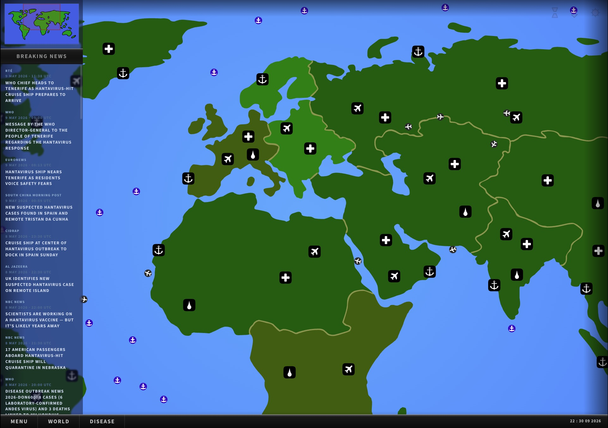

# Hantavirus Tracker

Track the hantavirus outbreak using the UI of "Pandemic 2"

## Making

The assets were decompiled from the original game using [FFDec](https://github.com/jindrapetrik/jpexs-decompiler). The positioning information for borders and the relative offsets of continents from each other were found by forking [ruffle](https://github.com/ruffle-rs/ruffle/) and doing dynamic instrumentation as the game set up the map on load. A combination of both techniques were used to extract the route ships coming out of the shipyard takes (which you can see by adding a special debug url param https://hantavirus.xetera.dev/?debug)
